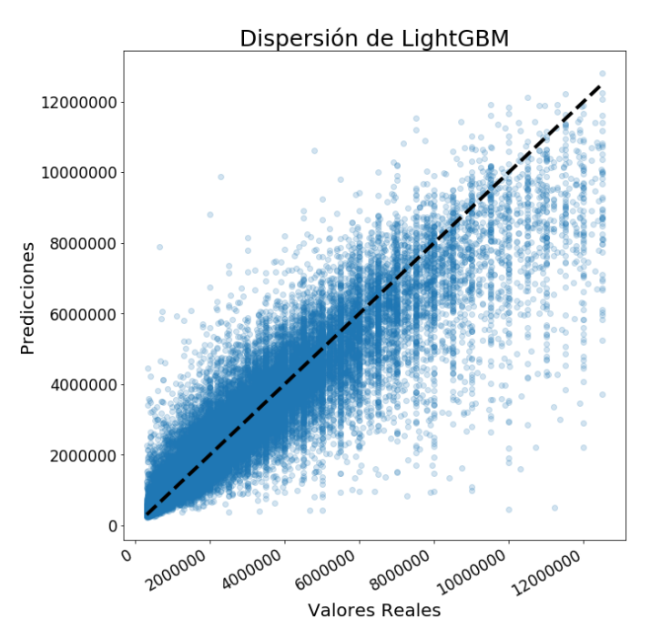

# Predicción de precios de propiedades 

Modelo que realiza predicciones del precio de un conjunto de propiedades (test.csv) con un error cuadrático promedio de menos de $450 000, lo que probablemente sea un nivel de exactitud comparable al de una persona que realiza la tasación con la misma información disponible, ya que con un precio promedio de $2,5 M, se está hablando de un error de menos del 20%. 

El archivo de entrenamiento (train.csv) y los archivos auxiliares de features se encuentran acá:
https://drive.google.com/drive/u/0/folders/1H2oI3BzbxFv09lwY5HPOgJUFI526HqcZ

## Hecho con
- komod0
- ffelfis
